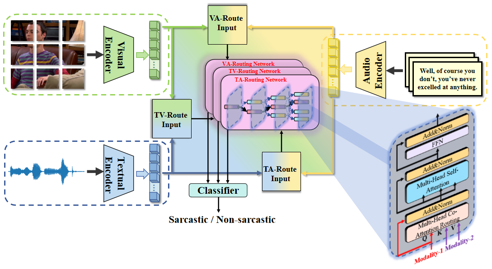

# DyCR-Net
This repository contains (PyTorch) code and pre-trained models for Dynamic Context-aware Routing Network (DyCR-Net)

## Overview

In this work, we present a novel framework for multimodal sarcasm detection. 
Please find more details of this work in our paper.
## Setup

### Install dependencies
Please install all the dependency packages using the following command:
```
pip install -r requirements.txt
```
### Datasets
	MUStARD dataset--link:
	Text data - It is available at https://github.com/soujanyaporia/MUStARD in data/sarcasm_data.json location. We also provide train, valid and text dlog ids with them.
	Audio data - We first obtain raw video from https://github.com/soujanyaporia/MUStARD and convert those videos to audio format corresponding to the last utterance   of every dialog. The we proceed to obtain audio features in the same manner as described in https://github.com/thuiar/MIntRec/tree/main/tools/audio_preprocess.py 
	Video data - We get raws videos from https://github.com/soujanyaporia/MUStARD and obtain the video features corresponding to last utterance from https://github.com/soujanyaporia/MUStARD under Run the code section point 3 Download the pre-extracted visual features. 
	Memotion dataset--[link](https://github.com/terenceylchow124/Meme-MultiModal.git)
	UR-FUNNY dataset--[link](https://github.com/ROC-HCI/UR-FUNNY?tab=readme-ov-file)

### Pretrained model
Download the pre-trained model roberta-base and corresponding files from 
[roberta-base](https://huggingface.co/roberta-base/). Put these files in `roberta-base/` folder.
Download the pre-trained model clip-vit-base-patch32 and corresponding files from 
[vit](https://huggingface.co/openai/clip-vit-base-patch32/). Put these files in `clip-vit-base-patch32/` folder.

## Model

### Train/evaluate the model
The parameter configuration files for training and testing are in the fold `config/`.
You can use `train.py` to train a DyCR-Net model. A command template is as follows:
```bash
CUDA_VISIBLE_DEVICES=0 python train.py {path of the parameter configuration file} \
```
You can use `test.py` to evaluate an existing model.
```bash
CUDA_VISIBLE_DEVICES=0 python test.py {path of the parameter configuration file} \
```

The experimental results will be stored in a subfolder of the folder `exp/{date-time}/`. In this fold, `log.txt` is the log file, JSON file is the parameter configuration file. 


